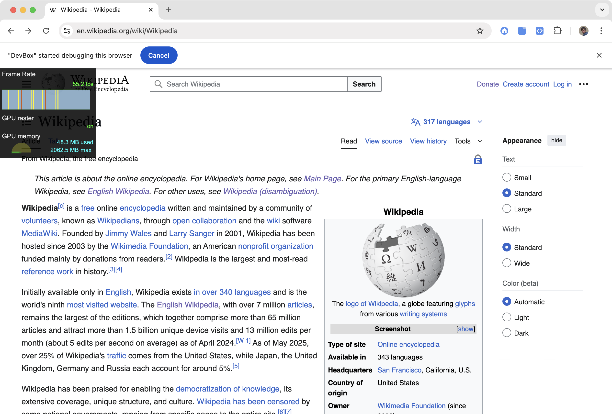
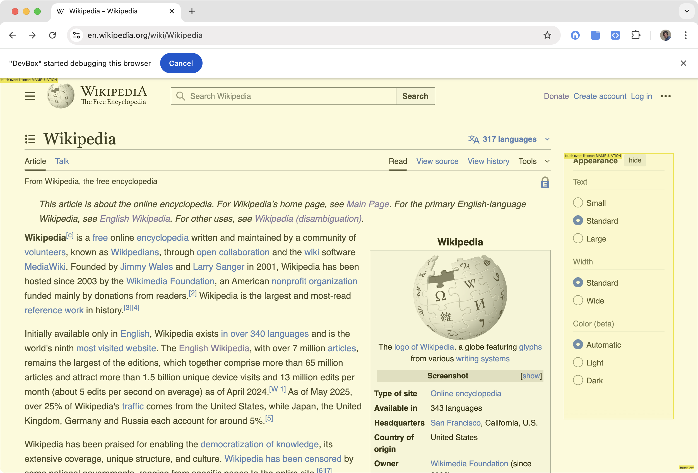
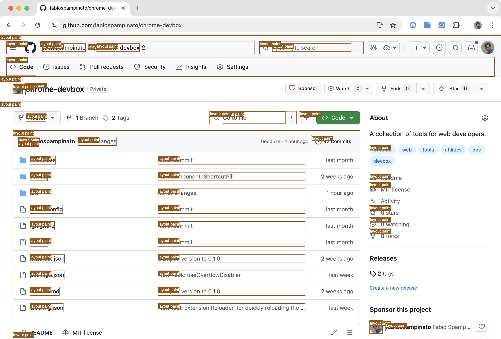

# DevBox ([DOWNLOAD](https://chrome.google.com/webstore/detail/devbox/melbfbeneddfjldinfckcgekaehafbed))

A collection of tools for web developers.

## Tools

| [Actions](#actions)               | [Throttlers](#throttlers)       | [Native Overlays](#native-overlays)                             | [Custom Overlays](#custom-overlays)                 |
| --------------------------------- | ------------------------------- | --------------------------------------------------------------- | --------------------------------------------------- |
| [Clear Console](#clear-console)   | [CPU Throttler](#cpu-throttler) | [FPS Meter](#fps-meter)                                         | [Containment Outliner](#containment-outliner)       |
| [Start Debugger](#start-debugger) |                                 | [Layer Outliner](#layer-outliner)                               | [Element Counter](#element-counter)                 |
|                                   |                                 | [Paint Highlighter](#paint-highlighter)                         | [Element Outliner](#element-outliner)               |
|                                   |                                 | [Scroll Bottleneck Highlighter](#scroll-bottleneck-highlighter) | [Intrinsic Size Outliner](#intrinsic-size-outliner) |
|                                   |                                 |                                                                 | [Lag Radar](#lag-radar)                             |
|                                   |                                 |                                                                 | [Mutation Highlighter](#mutation-highlighter)       |
|                                   |                                 |                                                                 | [Pointer Highlighter](#pointer-highlighter)         |
|                                   |                                 |                                                                 | [Rulers](#rulers)                                   |
|                                   |                                 |                                                                 | [Web Component Outliner](#web-component-outliner)   |

## Tools Selector

| Demo                                  | Demo                                  |
| ------------------------------------- | ------------------------------------- |
|  |  |

The tools selector is a way to quickly access each tool.

It can either be toggled by clicking the extension icon in the toolbar, or with a `Ctrl+Cmd+Space` (Mac) or `Ctrl+Alt+Shift+Space` (Windows/Linux).

## Actions

Actions are functions that just do one thing right when invoked.

### Clear Console

Clears the console. Useful for clearing out debug logging before interacting with the app again.

### Start Debugger

Starts the debugger. Useful for debugging things like popovers which may otherwise close themselves as soon as the window loses focus.

## Throttlers

Throttlers are tools that artificially slow things down in the page, to simulate slower devices.

### CPU Throttler

Toggles x4 CPU throttling on and off. Useful to check if things stay smooth on significantly slower devices.

## Native Overlays

Native overlays are debugging tools implemented by the browser itself, they require using the Chrome Debugging Protocol, which unfortunately will cause an ugly banner to be rendered telling you that the extension is using it, and they will work even if the DevTools window is not open.

### FPS Meter

| Demo                                                  | Demo                                                  |
| ----------------------------------------------------- | ----------------------------------------------------- |
|  |  |

Renders the current frames per second (FPS) for the page.

Useful for checking the smoothness of an interaction.

### Layer Outliner

| Demo                                                       | Demo                                                       |
| ---------------------------------------------------------- | ---------------------------------------------------------- |
|  |  |

Renders an outline around each rendering layer in the page.

Useful to make sure the layers that are used make sense, as having too many of them can be slow.

### Paint Highlighter

| Demo                                                          | Demo                                                          |
| ------------------------------------------------------------- | ------------------------------------------------------------- |
|  |  |

Renders a rectangle over areas that are repainted by the browser.

Useful for checking that the browser is not repaiting too much stuff unnecessarily, which would be slow.

### Scroll Bottleneck Highlighter

| Demo                                                                      | Demo                                                                      |
| ------------------------------------------------------------------------- | ------------------------------------------------------------------------- |
|  |  |

Renders a rectangle over areas that may slow down scrolling.

Unclear how useful this is in practice, there are no docs about it.

## Custom Overlays

Custom overlays are additional tools that are implemented in userland by this extension.

### Containment Outliner

| Demo                                                             | Demo                                                             |
| ---------------------------------------------------------------- | ---------------------------------------------------------------- |
|  |  |

Renders an outline around each element that sets some form of containment.

Useful for checking that containment is being used where it can, as it can speed-up rendering in some cases.

Only the following CSS properties are currently looked at: `contain`, `content-visibility`, `overflow`.

### Element Counter

| Demo                                                        | Demo                                                        |
| ----------------------------------------------------------- | ----------------------------------------------------------- |
|  |  |

Renders an outline around each element in the page, along with a label counting itself and its children, recursively.

Useful for checking that we aren't paying for things we can't see (unopened popovers etc.), and for checking that what we can see is using a reasonable number of elements, as having too many elements on the page is normally one of the main factors causing slowness.

### Element Outliner

| Demo                                                         | Demo                                                         |
| ------------------------------------------------------------ | ------------------------------------------------------------ |
|  |  |

Renders an outline around each element in the page, along with a label showing its tag name.

Useful for quickly checking that the right elements are being used throughout the page.

### Intrinsic Size Outliner

| Demo                                                                | Demo                                                                |
| ------------------------------------------------------------------- | ------------------------------------------------------------------- |
|  |  |

Renders an outline around each element that has an intrinsic size applied to it.

Useful for debugging mismatches between the estimated/intrinsic size, and the actual measured size.

### Lag Radar

| Demo                                                  | Demo                                                  |
| ----------------------------------------------------- | ----------------------------------------------------- |
|  |  |

Renders a linear radar at the top of the page, showing slowdowns in red.

Useful for checking if an interaction is causing some jank, which will cause some red to be rendered in the radar, even though it may not be obviously perceivable on your device.

This is built on top of an 8ms interval, where the idea is that if longer than 8ms has passed since the previous invokation that's considered a lag event, and the longer it passed the more and the more saturated red blocks will be rendered.

### Mutation Highlighter

| Demo                                                             | Demo                                                             |
| ---------------------------------------------------------------- | ---------------------------------------------------------------- |
|  |  |

Renders a flashing rectangle around each element that got mutated in the DOM.

Useful for checking that no unnecessary mutations are happening in the page, which can slow things down.

This is similar to the Paint Highlighter, in that a mutation often causes a repaint, but sometimes a repaint should not be caused by a mutation, perhaps because it should be fully driven by CSS, so this tool allows you to spot potentially unnecessary mutations that are happening.

### Pointer Highlighter

| Demo                                                            | Demo                                                            |
| --------------------------------------------------------------- | --------------------------------------------------------------- |
|  |  |

Renders a circle around the pointer when performing an interaction with it.

A segment indicating which button was presesed will be rendered too, along with a label showing the active modifier keys, if any.

Useful for screencasts or demos.

### Rulers

| Demo                                               | Demo                                               |
| -------------------------------------------------- | -------------------------------------------------- |
|  |  |

Renders a pair of rulers on the page, optionally with guides and a grid too.

Useful for quickly checking that things are properly aligned in the page.

The following interactions are supported:
- Dragging from either ruler will create a new guide that can be positioned anywhere.
- Dragging a guide will move it.
- Alt+Clicking a guide will remove it.
- Clicking the top-left corder where the two rulers meet will toggle the grid.
- Alt+Clicking the top-left corner will remove all guides.

### Web Component Outliner

| Demo                                                               | Demo                                                               |
| ------------------------------------------------------------------ | ------------------------------------------------------------------ |
|  |  |

Renders an outline around each web component in the page, along with a label showing its tag name.

Useful for quickly checking that the right web components are being used, or what their names are.

## License

MIT © Fabio Spampinato
